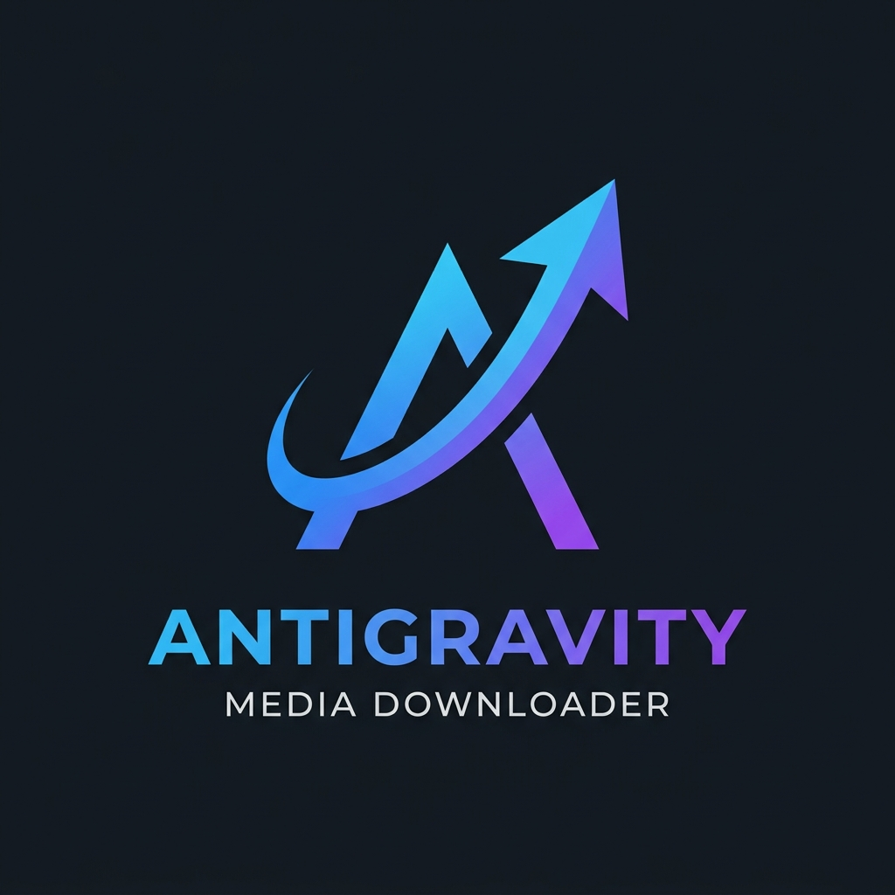

# Ndownloader

A modern, minimalist, and robust Windows desktop application for downloading videos and audio from various sources using `yt-dlp` and `ffmpeg`.



## Features
- **Minimalist Premium UI**: Ultra-clean interface with pure Dark and Light modes.
- **Multilingual Support**: Toggle between Spanish and English instantly.
- **Thumbnail Support**: See exactly what you are downloading.
- **Organized Queue**: Separate tabs for Queue, Completed, and Errors.
- **Multi-format Support**: HLS (.m3u8), DASH (.mpd), MP4, WebM, MKV, MP3, etc.
- **Platform Support**: YouTube, Vimeo, Twitter, and 1000+ other sites.
- **Clipboard Detection**: Automatically detects URLs copied to your clipboard.
- **Quality Control**: Select between Best, 1080p, 720p, or 480p.
- **Internal FFmpeg**: No system installation required (bundled with the app).

## Installation

### For Users
1. Download the latest `Ndownloader.exe` from the Releases page.
2. Run and enjoy!

### For Developers
1. Clone the repository.
2. Install dependencies:
   ```bash
   pip install -r requirements.txt
   ```
3. Run the app:
   ```bash
   python main.py
   ```

## Building from source
To create a standalone `.exe`:
```bash
python build_exe.py
```

## Technologies
- **Python 3.10+**
- **PyQt6** (GUI)
- **yt-dlp** (Download Engine)
- **FFmpeg** (Media Processing)

---
© 2026 Shoropio Corporation. All rights reserved.
